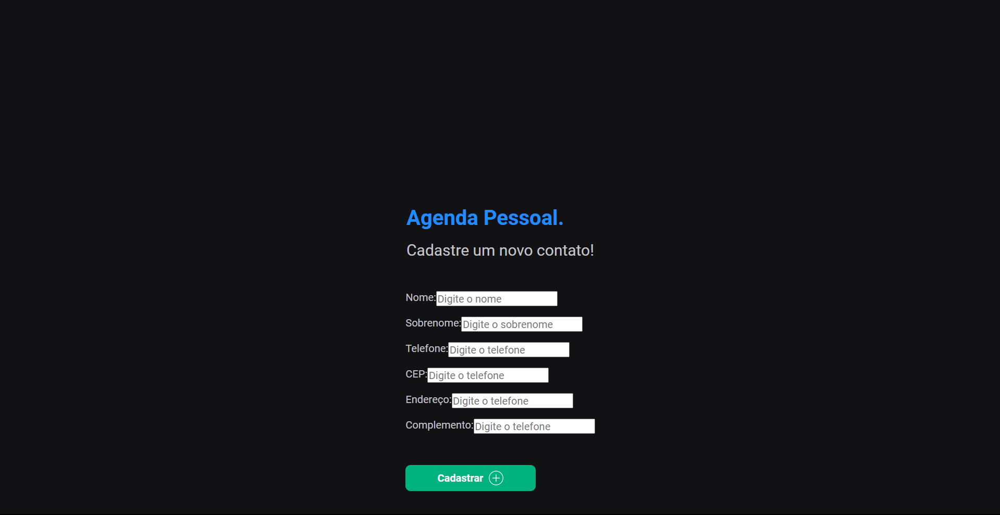

<h1 align="center">📚 Cadastro de Contatos JSP - Programação Web I</h1>

> Formativa aplicada pelo professor Adriano Maia.

## 📢 Sobre a Questão

Elabore um sistema WEB que simule uma agenda.

Deve-se coletar os dados em uma página html, posteriormente enviar para um
Servlet que transfere os dados para uma página jsp de exibição dos dados
coletados.

Necessário um vídeo mostrando o funcionamento.

### 📋 Critérios avaliados

1. Campos que foram definidos no slide devem ser obrigatórios;
2. Os dados devem ser passados para outra view;
3. Deve ser utilizado ao menos um servlet;

## 🎯 Ferramentas utilizadas no desenvolvimento da aplicação:

- `Java 19`
- `Jarkarta EE`
- `IntelliJ IDEA`
- `GIT`

## 📚 Oque está sendo entregue

Nessa aplicação o usuário conseguirá cadastrar na sua agenda um contato.

Para uma comprovação de um código funcinal, foi utilizado
do [GitHubActions](https://github.com/features/actions)
responsável por ci/cd,
que testará o código e verificará se funciona corretamente em cada `push`
e `pull-request` feita no repo.

Vídeo mostrando o funcionamento da aplicação:

Vídeo com maior qualidade pode ser encontrado
[aqui](.github/video/app-overview.mp4)

## 🦥 Futuras atualizações

Na aplicação, pode-se encontrar alguns _@todos_ que vão ser
implementados
como
forma externa a avaliação, com
o intuito de melhorar a qualidade do código.

- `Criação de testes unitários`: Será criado testes unitários para
  garantirem a qualidade do código.

## 🚀 Releases

Cada release foi gerada por uma `Command Line Interface` (CLI)
chamada [GitHub CLI](https://cli.github.com/).
As releases são categorizadas por versão da aplicação, onde cada uma possui um
nome e um arquivo executável.

Caso queira uma release mais recente ou especifica,
basta [clicar aqui](https://github.com/deverebor/personal-schedule-jsp/releases/)
.

---

  Developer with ❤️‍🔥 by Lucas Souza (@deverebor)

